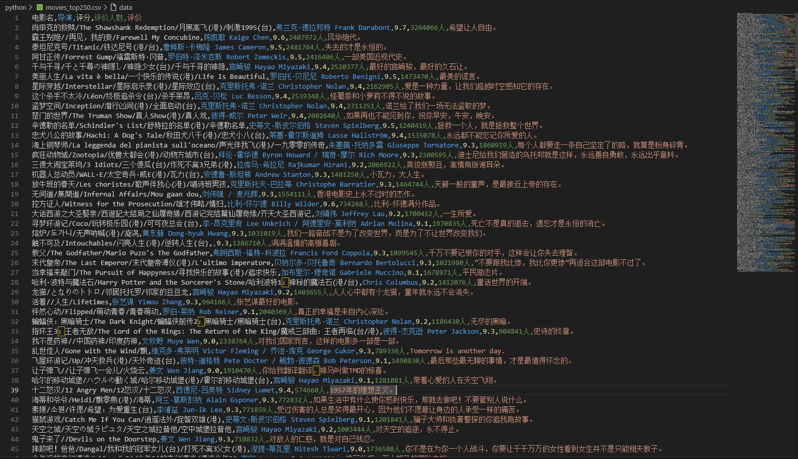

# my_spider
# 豆瓣电影 Top250 爬虫

一个基于 Python 的爬虫脚本，用于抓取豆瓣电影 Top250 的电影信息（排名、片名、导演、年份、评分等），并将结果保存为 CSV 文件。本项目作为爬虫学习的入门实践，展示了基础的 HTTP 请求、页面解析和数据存储能力。

## 🛠️ 技术栈

- **Python 3.8+**
- **requests** - 发送 HTTP 请求，获取网页 HTML
- **BeautifulSoup4** - 解析 HTML，提取结构化数据
- **csv / json** - 数据存储与导出

### 环境要求
- Python 3.8 或更高版本
- pip 包管理工具

### 运行结果截取

   
